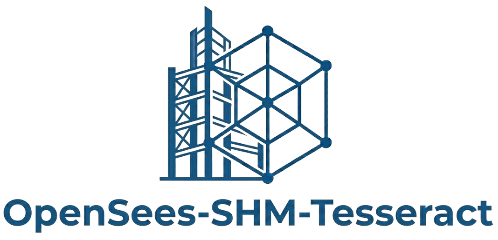
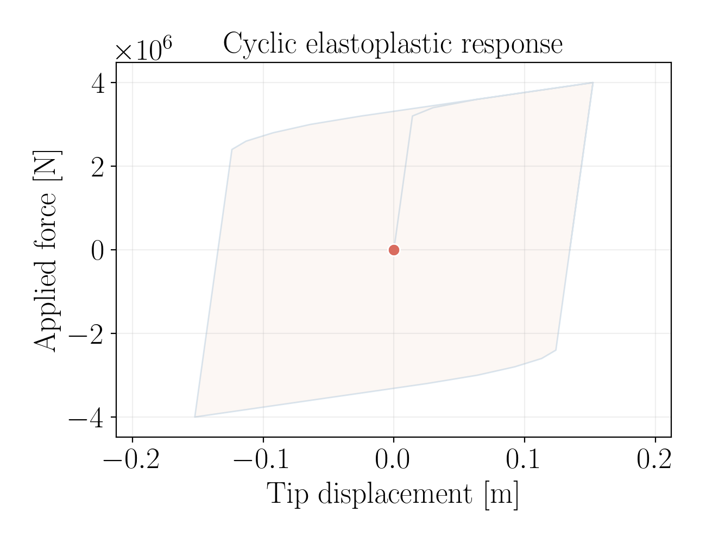
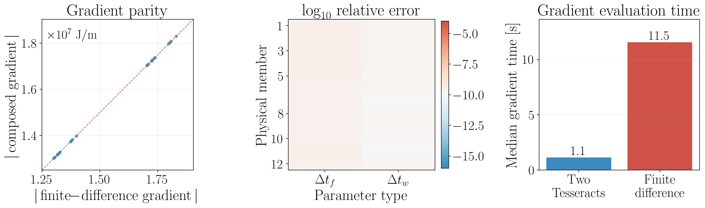
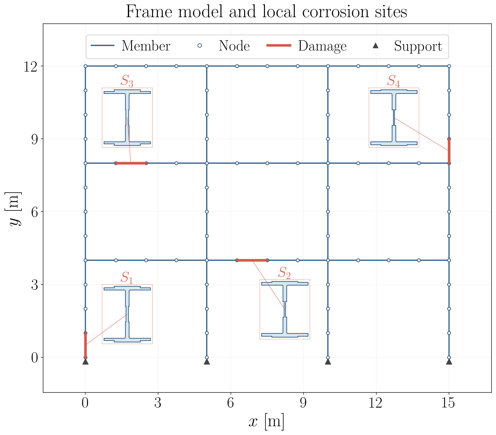
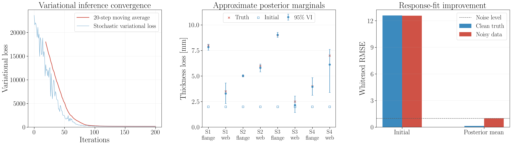
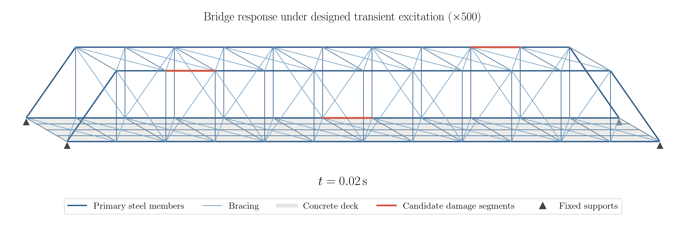
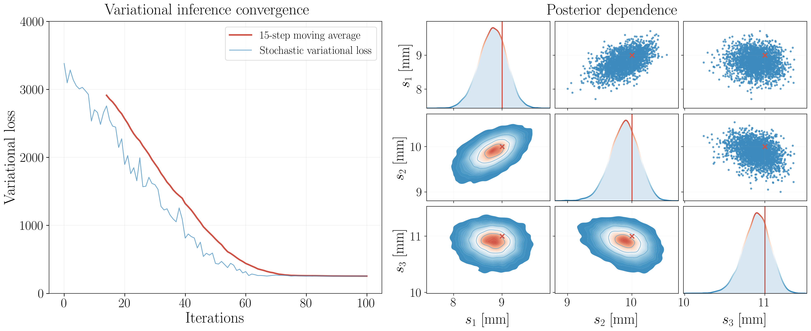

# Differentiable Structural Health Monitoring with Tesseract

**Tesseract Hackathon 2026 · Track 04 · Differentiable Inference & UQ**

<p align="center">
  
</p>

This project develops an end-to-end differentiable framework for uncertainty quantification, aimed at structural health monitoring (SHM) of steel structures with localized corrosion. [Tesseract](https://docs.pasteurlabs.ai/projects/tesseract-core/latest/) connects cross-section analysis in [sectionproperties](https://sectionproperties.readthedocs.io/en/stable/) with structural simulation in [OpenSees](https://opensees.github.io/OpenSeesDocumentation/), enabling [JAX](https://docs.jax.dev/en/latest/)-based gradient computation and Bayesian inference across the complete model.

Authors: [Weipeng Xu](https://github.com/xwpken), [Ziyuan Xie](https://github.com/xiezy964), [Dazhi Zhao](https://github.com/dazhizhao), [Tianju Xue](https://github.com/tianjuxue)

For any questions, please contact the team at [wxuby@connect.ust.hk](mailto:wxuby@connect.ust.hk)

## Table of contents
- [Introduction](#introduction)
- [Modeling framework](#modeling-framework)
- [The composition](#the-composition)
- [Why Tesseract](#why-tesseract)
- [Installation](#installation)
- [Examples](#examples)
  - [1. Gradient validation](#1-gradient-validation)
  - [2. Static frame corrosion inference](#2-static-frame-corrosion-inference)
  - [3. Transient bridge corrosion inference](#3-transient-bridge-corrosion-inference)
- [Repository structure](#repository-structure)
- [References](#references)
- [License](#license)

## Introduction

Corrosion is a major source of stiffness degradation in steel structures. The practical importance of detecting localized corrosion is illustrated by the documented school-building investigation [[1]](#ref-1). Since affected regions are often difficult to inspect directly, structural health monitoring (SHM) commonly relies on changes in measured displacements, strains, or vibration responses to infer the underlying damage. This leads to an inverse problem: given noisy structural measurements and a mechanical model, estimate the severity of deterioration at candidate regions and quantify the remaining uncertainty.


For local corrosion, the parameter-to-observation relationship naturally spans two modeling scales. A local loss of flange or web thickness changes the cross-sectional geometry of a member. The modified geometry changes its area and bending inertia, which changes the stiffness distribution of the assembled structure and ultimately its measured response. The forward map is

```math
\boldsymbol\theta
\longmapsto
\boldsymbol p(\boldsymbol\theta)
\longmapsto
\boldsymbol r\!\left(\boldsymbol p\right)
\longmapsto
\boldsymbol y,
```

where $\boldsymbol\theta$ denotes corrosion parameters, $\boldsymbol p$ denotes section properties, $\boldsymbol r$ is the structural response history, and $\boldsymbol y$ contains the quantities used for inference. Gradient-based Bayesian calibration requires repeated evaluation of both this map and its derivatives with respect to $\boldsymbol\theta$.

## Modeling framework

In this project, we consider a two-scale mechanical model that resolves both the local effect of corrosion on a steel cross-section and its global effect on the response of the assembled structure. These two stages are implemented using established engineering libraries.

At the cross-section scale, `sectionproperties` [[2]](#ref-2) provides computational-geometry, meshing, and cross-section analysis capabilities for arbitrary section shapes. It maps a parameterized section geometry to properties such as area, centroid, and second moments of area, which can then be supplied to a member- or system-level mechanical model.

At the structural scale, [OpenSeesPy](https://openseespydoc.readthedocs.io/) [[4]](#ref-4) provides Python access to `OpenSees`, a finite-element framework for structural and earthquake engineering [[3]](#ref-3). It assembles the global structure from nodes, constraints, coordinate transformations, sections, elements, and load patterns; solves the prescribed analyses; and returns the requested nodal responses. The `OpenSees` Direct Differentiation Method (DDM) supplies sensitivities of those responses with respect to registered structural parameters.

The two libraries operate through numerical mechanisms outside the native `JAX` computation graph: `sectionproperties` performs geometry and section finite-element calculations, while `OpenSees` is a stateful solver with its own sensitivity machinery. End-to-end inference therefore requires a common interface for composing derivatives across both boundaries:

```math
\frac{\partial \boldsymbol y}{\partial \boldsymbol\theta}
=
\frac{\partial \boldsymbol y}{\partial \boldsymbol r}
\frac{\partial \boldsymbol r}{\partial \boldsymbol p}
\frac{\partial \boldsymbol p}{\partial \boldsymbol\theta}.
```

This project packages the section and structural analyses as separate `Tesseract` components [[5]](#ref-5). Each component exposes its native forward calculation together with a vector-Jacobian product. [Tesseract-JAX](https://docs.pasteurlabs.ai/projects/tesseract-jax/latest/) composes these interfaces with response processing and probability calculations in `JAX` [[6]](#ref-6). The resulting end-to-end gradient drives variational inference with [BlackJAX](https://blackjax-devs.github.io/blackjax/) [[7]](#ref-7) and optimization with [Optax](https://optax.readthedocs.io/en/latest/) [[8]](#ref-8).

The contribution is a set of explicit differentiable contracts that turns an existing cross-section-to-structure workflow into a reusable parameter-to-observation map for inverse analysis and uncertainty quantification.

## The composition

Let $\mathcal S$ denote the `section-properties` Tesseract, $\mathcal G$ the `JAX` mapping from section outputs to registered element parameters, $\mathcal O$ the `opensees-ddm` Tesseract, and $\mathcal H$ the `JAX` observation operator. The forward model is

```math
\boldsymbol c=\mathcal S(\boldsymbol\theta),
\qquad
\boldsymbol p=\mathcal G(\boldsymbol c),
\qquad
\boldsymbol r=\mathcal O(\boldsymbol p),
\qquad
\boldsymbol y=\mathcal H(\boldsymbol r).
```

The corrosion parameters $\boldsymbol\theta$ define the section geometry. The first Tesseract runs the `sectionproperties` geometry, meshing, and section analysis to obtain $\boldsymbol c$. The `JAX` mapping $\mathcal G$ selects or scales these properties into the parameter vector $\boldsymbol p$ registered in `OpenSees`. The second Tesseract runs the prescribed structural analysis and returns the response history $\boldsymbol r$, from which $\mathcal H$ constructs the observations used by the objective or likelihood.

For a scalar loss $\mathcal L$, `JAX` first differentiates the observation and statistical calculations to obtain a cotangent for $\boldsymbol r$. The `opensees-ddm` VJP then rebuilds and reruns the analysis with DDM enabled, reads the nodal response sensitivities, and contracts them with that cotangent. `JAX` differentiates $\mathcal G$, after which the `section-properties` VJP perturbs the corrosion variables, reruns the native section analysis, and contracts the resulting property derivatives. This returns $\partial\mathcal L/\partial\boldsymbol\theta$ to the variational optimization.

```text
local corrosion parameters
          θ
          │
          ▼
┌──────────────────────────────────────────────┐
│ Tesseract A — section analysis               │
│ sectionproperties: geometry + mesh + FEM     │
└──────────────────────────────────────────────┘
          │  section properties c
          ▼
┌──────────────────────────────────────────────┐
│ JAX property mapping                         │
│ section properties c → OpenSees parameters p │
└──────────────────────────────────────────────┘
          │  registered parameters p
          ▼
┌──────────────────────────────────────────────┐
│ Tesseract B — structural analysis            │
│ OpenSees: static/transient analysis + DDM     │
└──────────────────────────────────────────────┘
          │  response history r
          ▼
┌──────────────────────────────────────────────┐
│ JAX statistical layer                        │◀──── observed data y_obs
│ observation operator + log density + ELBO    │
└──────────────────────────────────────────────┘
          │  objective and gradients
          ▼
┌──────────────────────────────────────────────┐
│ BlackJAX variational family + Optax updates  │
└──────────────────────────────────────────────┘
          │
          ▼
approximate posterior q_φ(θ | y_obs)
damage estimates and uncertainty
```

## Why Tesseract

The numerical stages expose different derivative capabilities and interfaces. The project equips `sectionproperties` with a finite-difference pullback and uses the DDM response sensitivities available from `OpenSees`. `Tesseract` gives both solvers a common forward-and-pullback contract, allowing `Tesseract-JAX` to compose them as one differentiable operation.

The `section-properties` Tesseract treats `section_spec` as static configuration and the corrosion array $\boldsymbol\theta\in\mathbb R^{n_s\times2}$ as its differentiable input. It returns $\boldsymbol p\in\mathbb R^{n_s\times6}$ containing area, centroid, and second moments of area, and evaluates its pullback through finite-difference contractions of the native `sectionproperties` calculation.

The `opensees-ddm` Tesseract treats the serialized analysis program as static configuration and the registered `OpenSees` parameter vector $\boldsymbol p$ as its differentiable input. It returns a response history $\boldsymbol r\in\mathbb R^{n_t\times n_r}$. During the pullback, `OpenSees` DDM supplies the response sensitivities and the wrapper contracts them with the incoming response weights to produce the parameter gradient.

For a scalar objective $\mathcal L$, `Tesseract-JAX` composes these pullbacks with the `JAX` portion of the calculation:

```math
\frac{\partial \mathcal L}{\partial \boldsymbol\theta}
=
\left(
\frac{\partial \boldsymbol p}{\partial \boldsymbol\theta}
\right)^\mathsf{T}
\left(
\frac{\partial \boldsymbol r}{\partial \boldsymbol p}
\right)^\mathsf{T}
\left(
\frac{\partial \boldsymbol y}{\partial \boldsymbol r}
\right)^\mathsf{T}
\frac{\partial \mathcal L}{\partial \boldsymbol y}.
```

The section component supplies the first pullback, the DDM sensitivities and wrapper contraction supply the second, and `JAX` differentiates the observation and statistical layers. `BlackJAX` uses the resulting gradient at every variational update.

## Installation

Following the instructions below will create a Python virtual environment and install the required dependencies.

```bash
git clone https://github.com/xwpken/opensees-shm-tesseract.git
cd opensees-shm-tesseract

python3.13 -m venv .venv
source .venv/bin/activate
python -m pip install --upgrade pip
python -m pip install -r requirements.txt
```

## Examples

### 1. Gradient validation

This example validates the complete differentiable composition on a nonlinear, path-dependent problem before it is used inside an inference workflow.

#### Model

The structure is a quasi-one-dimensional chain of $12$ serial truss elements. Each element uses the `OpenSees` `Steel01` material model with fixed yield stress $F_y=250$ MPa, elastic modulus $E=200$ GPa, and hardening ratio $b=0.02$. Its independent geometric inputs are the flange and web losses

```math
\boldsymbol\theta_i = [\Delta t_{f,i},\Delta t_{w,i}],
\qquad i=1,\ldots,12.
```

The complete model therefore has $24$ corrosion parameters. The `section-properties` Tesseract maps each pair to its corroded section properties, and the resulting area $A_i$ is passed directly to the corresponding `OpenSees` truss element as a registered DDM parameter:

```math
\boldsymbol\theta
\longmapsto
\boldsymbol A(\boldsymbol\theta)
\longmapsto
\boldsymbol u
\longmapsto
W.
```

A $120$-step cyclic force history produces elastic loading, yielding, unloading, and load reversal.

The differentiated scalar output is the discrete hysteretic work

```math
W = \sum_{n=1}^{N}
\frac{F_n+F_{n-1}}{2}
(u_n-u_{n-1}).
```

The `section-properties` Tesseract differentiates the corrosion-to-area map, the `opensees-ddm` Tesseract uses `OpenSees` DDM for the area-to-displacement map, and `JAX` differentiates the hysteretic-work calculation. The reference gradient perturbs the original corrosion parameters and repeats the entire section and structural analyses, providing an end-to-end check of the composed pipeline.

#### Results

Figure 1 shows the yielding, unloading, and load reversal captured by the cyclic analysis. For the resulting $24$ corrosion parameters and $120$ load increments, the composed gradient agrees with full-pipeline central finite differences to a relative $L_2$ error of approximately $2.3\times10^{-10}$, and all active gradient signs agree. As summarized in Figure 2, the composed pipeline is approximately $10\times$ faster than central differences.

<p align="center">
  
  <br><em>Figure 1. Cyclic elastoplastic force--displacement response.</em>
</p>


<p align="center">
  
  <br><em>Figure 2. End-to-end gradient accuracy and evaluation time.</em>
</p>

Reproduce this example:

```bash
# Validate the composed gradient and generate the hysteresis diagnostics.
python examples/gradient/validate_gradient.py
```

Key outputs:

```text
figs/gradient_hysteresis.gif    # animated force-displacement history
figs/gradient_validation.png    # gradient accuracy and timing comparison
```

### 2. Static frame corrosion inference

This example applies the two-Tesseract composition to Bayesian estimation of localized corrosion in a two-dimensional, three-story, three-bay steel frame. Each bay is $5$ m wide, each story is $4$ m high, and every physical member is divided into four `OpenSees` `dispBeamColumn` elements.

#### Model and observations

Four candidate regions are placed on different beams and columns. Independent flange and web losses are inferred at each site,

```math
\boldsymbol\theta =
[\Delta t_{f,1},\Delta t_{w,1},\ldots,
 \Delta t_{f,4},\Delta t_{w,4}]
\in\mathbb R^8.
```

Figure 3 identifies the four candidate regions and shows the Boolean-cut section geometries evaluated by `sectionproperties`. The corresponding $(\Delta t_f,\Delta t_w)$ values in millimetres are $(8.0,3.5)$ at $S_1$, $(5.0,6.0)$ at $S_2$, $(9.0,2.5)$ at $S_3$, and $(4.0,7.0)$ at $S_4$. For every parameter vector, the `section-properties` Tesseract evaluates the corroded area $A$ and bending inertia $I_{xx}$, which are assigned to the corresponding local `OpenSees` elements.

<p align="center">
  
  <br><em>Figure 3. Frame model, candidate regions, and corroded section geometries.</em>
</p>

Two targeted static tests are applied at each site, giving eight load cases. Virtual sensors are placed at the three internal finite-element nodes of each candidate member. Under every load case, the horizontal displacement, vertical displacement, and rotation returned by `OpenSees` are used as observations. The data vector therefore contains $8\times12\times3=288$ nodal response values. Synthetic measurements follow

```math
\boldsymbol y_{\mathrm{obs}}
=
\boldsymbol f(\boldsymbol\theta_{\mathrm{true}})
+
\boldsymbol\sigma\odot\boldsymbol\epsilon,
\qquad
\boldsymbol\epsilon\sim\mathcal N(\boldsymbol 0,\boldsymbol I),
```

with a standard deviation equal to $2\%$ of the absolute response magnitude and a small common floor for near-zero responses.

#### Inference and results

The priors are $\Delta t_f\sim\mathcal U(0,12)$ mm and $\Delta t_w\sim\mathcal U(0,8)$ mm. A sigmoid transformation enforces these bounds, while `BlackJAX` fits a full-rank Gaussian in unconstrained coordinates. Starting from $2$ mm at every coordinate, the optimization uses $200$ updates, eight ELBO samples per update, an initial learning rate of $0.025$, and $10{,}000$ posterior samples.

Figure 4 summarizes the optimization, parameter estimates, and response fit. The Euclidean parameter error decreases from $11.895$ mm to $1.000$ mm; the whitened clean-response RMSE falls from $12.597$ to $0.138$ noise standard deviations, and the whitened noisy-data RMSE from $12.575$ to $1.007$. All eight true losses lie inside their $95\%$ marginal credible intervals.

<p align="center">
  
  <br><em>Figure 4. Full-rank VI results for the static frame.</em>
</p>

Reproduce this example:

```bash
# Generate the frame and corroded-section visualization in Figure 3.
python examples/shm_frame/visualize.py

# Validate the end-to-end Tesseract/OpenSees gradient.
python examples/shm_frame/validate_gradient.py

# Run full-rank VI and regenerate the stored inference results and figures.
python examples/shm_frame/infer.py \
  --steps 200 \
  --elbo-samples 8 \
  --posterior-samples 10000 \
  --learning-rate 0.025 \
  --noise-fraction 0.02
```

Generated files:

```text
figs/shm_frame_gradient.png    # end-to-end gradient validation
results/shm_frame.npz          # posterior samples and numerical diagnostics
figs/shm_frame_summary.png     # VI trajectory, marginals, and response error
figs/shm_frame_posterior.png   # full posterior dependence matrix
```

### 3. Transient bridge corrosion inference

This example estimates corrosion severity at three known candidate members of a three-dimensional steel pedestrian bridge.

#### Model and observations

The bridge is $36$ m long and $4$ m wide, with $87$ nodes, $233$ steel line elements, and $48$ deck shell elements. Three separated chord members are assigned corrosion parameters $\boldsymbol s=[s_1,s_2,s_3]$. At each site, the prescribed local damage shape uses

```math
\Delta t_f=s_i,
\qquad
\Delta t_w=0.8s_i,
```

so one severity jointly controls the flange and web losses through a fixed $1{:}0.8$ ratio. For each forward evaluation, the `section-properties` Tesseract computes the damaged section properties and maps the changes in $A$, $I_y$, and $I_z$ to the registered parameters of the `opensees-ddm` Tesseract.

A two-direction base pulse acts for $0.5$ s, followed by free vibration to $1.5$ s; the amplified deformation history is shown in Figure 5. Six three-axis accelerometers provide $26$ retained time samples and $18$ absolute-acceleration channels. Independent Gaussian noise uses $2\%$ of each channel RMS with a $10^{-4}g$ floor. The true severities are $(9,10,11)$ mm and the variational mean starts from $(2,2,2)$ mm. The end-to-end gradient has a relative $L_2$ error of $5.535\times10^{-7}$ against central finite differences.

<p align="center">
  
  <br><em>Figure 5. Bridge deformation under the designed transient excitation, amplified $500\times$.</em>
</p>

#### Inference and results

The priors are $s_i\sim\mathcal U(0,12.4)$ mm. `BlackJAX` fits a full-rank Gaussian in unconstrained coordinates using $100$ updates, four ELBO samples per update, and $10{,}000$ posterior samples.

The optimization history and learned parameter dependence are shown together in Figure 6. The posterior means are $(8.805,9.882,10.896)$ mm with standard deviations $(0.285,0.222,0.169)$ mm, and all three true values lie within their $95\%$ credible intervals. The clean-response RMSE decreases from $3.688$ to $0.067$ noise standard deviations, while the noisy-data RMSE decreases from $3.748$ to $1.019$.

<p align="center">
  
  <br><em>Figure 6. VI convergence and posterior dependence; red crosses mark the synthetic truth.</em>
</p>

Reproduce this example:

```bash
# Validate the end-to-end Tesseract/OpenSees gradient.
python examples/shm_bridge/validate_gradient.py

# Run full-rank VI and regenerate the stored inference results and figure.
python examples/shm_bridge/infer.py \
  --steps 100 \
  --elbo-samples 4 \
  --posterior-samples 10000 \
  --learning-rate 0.05
```

Generated files:

```text
results/shm_bridge.npz          # posterior samples and numerical diagnostics
figs/shm_bridge_inference.png   # VI trajectory and 3x3 posterior summary
```

## Repository structure

```text
opensees-shm-tesseract/
├── tesseracts/
│   ├── section_properties/
│   │   ├── section_solver.py
│   │   ├── tesseract_api.py
│   │   ├── tesseract_config.yaml
│   │   └── tesseract_requirements.txt
│   └── opensees_ddm/
│       ├── solver.py
│       ├── tesseract_api.py
│       ├── tesseract_config.yaml
│       └── tesseract_requirements.txt
├── examples/
│   ├── gradient/
│   │   ├── model.py
│   │   ├── plots.py
│   │   └── validate_gradient.py
│   ├── shm_frame/
│   │   ├── model.py
│   │   ├── experiment.py
│   │   ├── infer.py
│   │   ├── plots.py
│   │   ├── validate_gradient.py
│   │   └── visualize.py
│   └── shm_bridge/
│       ├── model.py
│       ├── experiment.py
│       ├── infer.py
│       ├── plots.py
│       ├── validate_gradient.py
│       └── visualize.py
├── utils/
│   ├── plot_style.py
│   └── gradient_check.py
├── figs/
├── results/
└── requirements.txt
```


## References

<a id="ref-1"></a>[1] K. Itle and M. Ford, “Failures: School corrosion underscores documentation importance,” *The Construction Specifier*, October 5, 2023. [Article](https://www.constructionspecifier.com/failures-school-corrosion-underscores-documentation-importance/). 

<a id="ref-2"></a>[2] R. van Leeuwen and C. Ferster, “sectionproperties: A Python package for the analysis of arbitrary cross-sections using the finite element method,” *Journal of Open Source Software*, vol. 9, no. 96, p. 6105, 2024. [doi:10.21105/joss.06105](https://doi.org/10.21105/joss.06105).

<a id="ref-3"></a>[3] F. McKenna, “OpenSees: A Framework for Earthquake Engineering Simulation,” *Computing in Science & Engineering*, vol. 13, no. 4, pp. 58–66, 2011. [doi:10.1109/MCSE.2011.66](https://doi.org/10.1109/MCSE.2011.66).

<a id="ref-4"></a>[4] M. Zhu, F. McKenna, and M. H. Scott, “OpenSeesPy: Python library for the OpenSees finite element framework,” *SoftwareX*, vol. 7, pp. 6–11, 2018. [doi:10.1016/j.softx.2017.10.009](https://doi.org/10.1016/j.softx.2017.10.009).

<a id="ref-5"></a>[5] D. Häfner and A. Lavin, “Tesseract Core: Universal, autodiff-native software components for Simulation Intelligence,” *Journal of Open Source Software*, vol. 10, no. 111, p. 8385, 2025. [doi:10.21105/joss.08385](https://doi.org/10.21105/joss.08385).

<a id="ref-6"></a>[6] R. Frostig, M. Johnson, and C. Leary, “Compiling machine learning programs via high-level tracing,” *SysML Conference*, 2018. [Publication](https://research.google/pubs/compiling-machine-learning-programs-via-high-level-tracing/).

<a id="ref-7"></a>[7] A. Cabezas et al., “BlackJAX: Composable Bayesian inference in JAX,” arXiv:2402.10797, 2024. [arXiv:2402.10797](https://arxiv.org/abs/2402.10797).

<a id="ref-8"></a>[8] I. Babuschkin et al., “The DeepMind JAX Ecosystem,” 2020. [Software citation](https://github.com/google-deepmind).

## License

Licensed under the Apache License 2.0. See [LICENSE](LICENSE).
